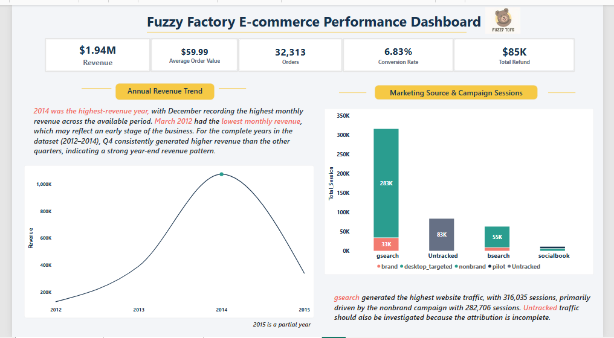
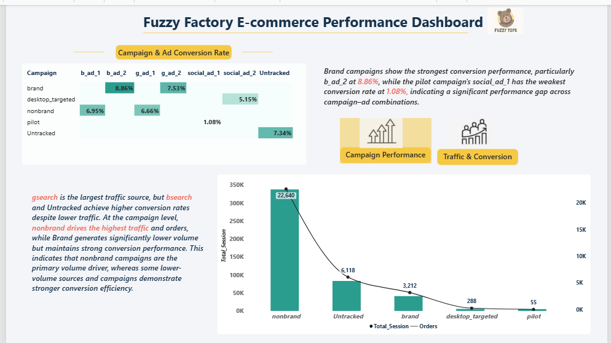
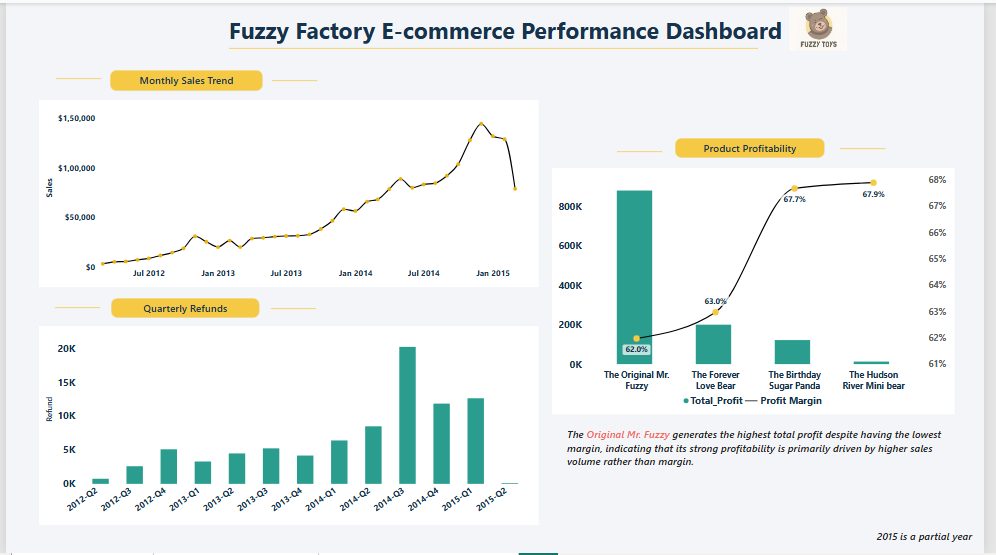

# Fuzzy Factory E-commerce Analysis

An end-to-end e-commerce analytics project using SQL and Power BI to analyze sales performance, marketing effectiveness, conversion, product profitability, and refunds.

## Project Overview

The objective of this project was to analyze Fuzzy Factory's e-commerce data and identify opportunities to improve revenue performance, marketing efficiency, product profitability, and customer acquisition.

The analysis was performed using SQL for data exploration and business analysis, followed by Power BI for data modeling, KPI development, visualization, and dashboard storytelling.

## Tools & Skills

- SQL (MySQL)
- Power BI
- DAX
- Data Modeling
- Data Cleaning
- KPI Development
- Business Analysis
- Data Visualization
- Dashboard Storytelling

## Key Business Questions

- How is revenue performing over time?
- Which marketing sources generate the most traffic?
- Which campaigns and ad combinations have the highest conversion rates?
- Which campaigns drive the highest order volume?
- Which products generate the most profit?
- How does profit margin differ across products?
- How are sales changing over time?
- How are refund amounts changing across quarters?

## Dashboard

### Page 1 — Executive Overview

Provides a high-level view of business performance, including revenue, average order value, orders, conversion rate, refunds, annual revenue trends, and marketing traffic.

### Page 2 — Marketing Performance

Analyzes marketing source performance, campaign traffic, conversion rates, and campaign-ad combinations to identify high-volume and high-efficiency acquisition channels.

### Page 3 — Product & Sales Performance

Analyzes monthly sales trends, quarterly refunds, product profitability, and profit margins.

## Key Insights

- **2014 was the highest-revenue year**, with December recording the highest monthly revenue across the available period.
- **gsearch generated the highest website traffic**, with 316,035 sessions, primarily driven by the nonbrand campaign.
- **bsearch and Untracked traffic achieved higher conversion rates than gsearch despite significantly lower traffic volumes**, highlighting a volume-versus-efficiency trade-off.
- **The Brand + b_ad_2 combination achieved the highest conversion rate at 8.86%**, while Pilot + social_ad_1 had the lowest at 1.08%.
- **Nonbrand campaigns generated the highest traffic and order volume**, making them the primary volume driver.
- **The Original Mr. Fuzzy generated the highest total profit despite having the lowest profit margin**, indicating that its profitability is driven primarily by higher sales volume.
- **December 2014 recorded the strongest monthly sales performance**, reinforcing the importance of the year-end period.
- **Refund amounts increased substantially during 2014**, with the highest quarterly refund amount occurring in 2014-Q3.

## SQL Analysis

SQL was used to perform the underlying business analysis, including:

- Revenue and sales trend analysis
- Marketing source and campaign performance
- Conversion rate analysis
- Product-level profitability
- Order and customer analysis
- Refund analysis

The Power BI dashboard was validated against the SQL analysis to ensure consistency in key business metrics.

## Power BI Dashboard

The complete `.pbix` file is available in the project release:

**[Download Power BI Dashboard](../../releases/latest)**

## Project Outcome

This project demonstrates an end-to-end analytics workflow:

**Raw E-commerce Data → SQL Analysis → Data Modelling → DAX Measures → Power BI Dashboard → Business Insights**

## Data Source

**Source:** Maven Analytics — Toy Store E-Commerce Database

The dataset is based on Maven Fuzzy Factory, an e-commerce business selling teddy bears. It contains data on website sessions, marketing channels, orders, products, and returns/refunds.

**License:** Public Domain

[View Dataset on Maven Analytics](https://mavenanalytics.io/data-playground/toy-store-e-commerce-database)
